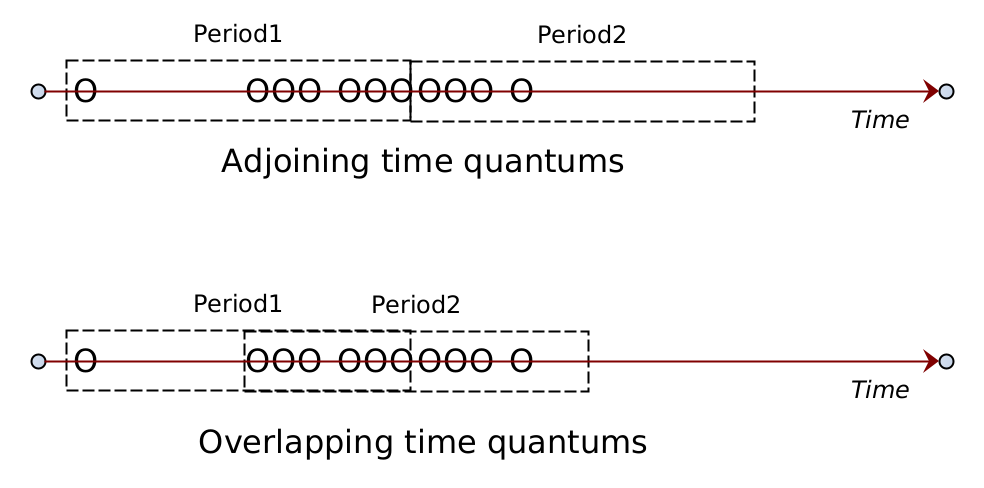

## Problem Statement we are solving here?

Kernel system calls and other event auditing are done by various tools to detect malicious behavior of a process. For e.g., if a process which is not part of a “set of processes/process spec” attempts to access a particular path using open() system call then the module will raise an alert since it doesn’t expect any process outside of a particular process spec to access that file or file system path.
Event monitoring/auditing systems are also used by various compliance frameworks (such as PCI-DSS, SOC2), hardening standards (such as STIGs) and attack frameworks (such as MITRE) that provide guidelines for setting up defense rules.
Falco is one such event monitoring/auditing system which uses eBPF or kernel module to filter system events at runtime in the kernel space and check for any malicious behavior based on rules passed from the user space monitor process.


Consider an example scenario where as per the policy only processes invoked from /usr/bin/* folder would be able to access the /etc/ folder. The allowed process spec in this case is any process from /usr/bin/* path.
Now let's assume at runtime there is a process XYZ which does not match the process spec and tries to access a file /etc/crontab.
As per the above figure, following steps will happen:
Process XYZ does an open() call on /etc/crontab. This results in a syscall(open) getting invoked in the kernel space.
The eBPF instruction set inserted for monitoring purposes will detect the syscall(open) event.
It verifies that the filter does not match, that is it finds that the process XYZ which is attempting to open the file /etc/crontab does not match the process spec. It forwards the event to the monitor process in the userspace.
Event monitoring systems can take into account spatial conditions for filtering and then raise an event that can be further used for analysis purposes. The spatial condition in the above example is that when a file open is attempted, the process context is additionally checked to verify if it belongs to a process spec before raising an event. Thus, the process context (name, pid, namespace, process path) are the spatial conditions on which the open() event could be further filtered.

#### Quality of such monitoring/filtering/auditing systems is dependent on:

1. How well the filters can represent the rules as mentioned in the compliance/hardening standards?
2. How much performance overhead is added by the filtering system?

#### Problems with monitoring/filtering/auditing systems:

There are two problems with such systems

1. There is no option to apply conditions based on rate-limit. For e.g., generate an audit event only when a certain system event is detected more than 10 times per unit time (say 1 min).
2. No option to apply temporal correlation. Currently the filters operate on the context available on that event instance. Temporal correlation is not possible. For e.g., setting a filter which says if network send() syscall is invoked more than 100 times in 1 min and file read() is invoked more than 100 times per second then raises an audit event.

#### Problems addressed by this design:

To overcome the problems mentioned above, this idea attempts to make two major changes:

1. The idea allows to specify the rate-limit filters and temporal correlation filters from the userspace, but the filter is completely handled in-kernel and only the final result is emitted to user-space. This prevents any unnecessary context-switches.

2. The idea provides an improved schematic/design to implement the rate-limit/temporal-correlation filters such that the memory overhead and the in-kernel processing overhead is kept to the minimum.

3. By using policy constructs defined in this idea, a policy engine could avoid a lot of false positives in the real environment making the security engine robust.

## Sample Use Cases

### Sample policy for rate-limited events

```yaml
apiVersion: security.accuknox.com/v1
kind: KubeArmorPolicy
metadata:
name: ksp-wordpress-config-block
namespace: wordpress-mysql
spec:
severity: 10
selector:
       matchLabels:
    app: wordpress
- process: *, -*/bash, -*/sh
  msg: "readdir limit exceeded"
  severity: 5
  - syscall: readdir
    param1: /*, -/home/*, -/var/log/*
    rate: 10p1s
```

Sample policy allowing temporal correlation of events

```yaml
apiVersion: security.accuknox.com/v1
kind: KubeArmorPolicy
metadata:
name: ksp-wordpress-config-block
namespace: wordpress-mysql
spec:
severity: 10
selector:
       matchLabels:
    app: wordpress
- process: *, -*/bash, -*/sh
  msg: "readdir limit exceeded"
  severity: 5
  - syscall: readdir
    param1: /*, -/home/*, -/var/log/*
    rate: 10p1s
```

## Design expectations & Limitations

### Design Expectations

The design should sufficiently explain:

1. How will the process filter work?
    1. How to ensure that least amount of overhead is incurred while handling processes which are not of interest?
    2. How to ensure that the events that the policies are not interested, do not induce additional control overhead?

2. What eBPF bytecodes have to be loaded, both statically and dynamically?

3. How event parameter handling will be done? Event parameter handling must incur the least overhead.

4. How rate-limiting will work?

### Limitations & Assumptions

1. Works only for systems supporting eBPF >=4.18

2. Different policies could induce different amounts of overhead. Thus, the use of syscalls to monitor must be properly reviewed and performance implications understood. In the future, we could have a system that can identify an approx overhead added by the policy and inform/alert the user.

3. This design assumes linux kernel >=4.18

## Sample reference policy

```yaml
apiVersion: security.accuknox.com/v1
kind: KubeArmorPolicy
metadata:
  name: detect-active-network-scanning
  namespace: multiubuntu
spec:
- process: *
  msg: "local reconn attempt with TCP scan"
  severity: 5
  - syscall: connect //FD1
    proto: *P
    ip4addr: 192.168.10.10/25 0xffffff80, 10.*.*.* 0xff0000000, 192.168.*.1 0xffff00ff
    rate: 20p1s

  - syscall: connect //FD2
    proto: FILE
    path: /tmp/*
    rate: 20p1s

- process: *, /bin/*sh, -*ssh
  msg: "consecutive RAW sends"
  severity: 5
  - syscall:raw_sendto
    param2: 192.168.*.*, 10.*.*.*
    rate: 20p1s

- process: *, /bin/*sh, -*ssh
  msg: "consecutive RAW sends"
  severity: 5
  - syscall: raw_send
    param2: 192.168.*.*, 10.*.*.*
    rate: 20p1s

- process: *
  msg: “outbound probes detected”
  severity:
  - kprobe: tcp_rst
    Rate: 10p1s

- process: *
  msg: “inbound probes detected”
  severity:
  - kprobe: tcp_rst_send
    Rate: 10p1s
```

> Note: Not every event might be associated with a process spec. There are events that are generated which may not have any associated task structure.

### What design constraints do we have to live with?

Example the # of bpf programs, the instructions, memory…

## Module Design


## Handling of events

### On New Policy

When a new policy is provided as an input the policy might be either a

1. Container based policy

2. Host based policy

In either case, a new entry would be added in the process_spec_table containing the pid-ns of the container. In case of host-based policy the pid-ns would be 0.

> process-spec-table

|   Container pid-ns   |  process-spec  |  event-filter-spec  |
| :----: | :---: | :---: |
| 12345 |   *   | [event1-fd1, event2-fd2, …] |
| 53678 |   /usr/bin/*sh   | [event3-fd3, ...] |
| 12312 |   *, -*/*sh   | [event4-fd4, event5-fd5, …] |
| 5235 |   [NA]   | ... |
| 0 (host-based) |   ...   | ... |

Points to note:

1. There could be several event-filter-specs for the same [pid-ns, process-spec] tuple.

2. 0 pid-ns indicates host-based rules

3. The event-filter-spec contains eBPF bytecode that is compiled on demand. The event-filter-spec has the event type/info for which the corresponding event/kprobe/tracepoint would be loaded.

4. Every event-filter-spec’s compiled bytecode is pre-loaded in the BPF_MAP_TYPE_PROG_ARRAY for tail-call processing and file-descriptor noted in the event-filter-spec column.


### On New Process

The process-filter-table is a bpf map that stores the mapping of {pid-ns, pid, event-id} to the corresponding set of { event-filter-fds }.

> process-filter-table

|   Pid-ns, pid, Event-ID   |  Event-filter-FD  |  Opaque Data  |
| :----: | :---: | :---: |
| { 0xcafebabe, 0xdeadface, SYSCALL-CONNECT} |   [FD1, FD2]   | [...event-handler can keep rate-info and other event specific data…] |
|   |       |   |

[TODO]: The process wildcard matching has to be done in the kernel space. Write a prototype code to validate the wildcard matching can be implemented effectively in kernel space.

|   Pid-ns, pid, Event-ID   |
| :----------------------- |
| Input: event_info_t (check next section for details) |
| 1. Check the process-spec-table and check if the container-pid-ns matches.<br/> &nbsp;    &nbsp; a. If there is no match, ignore the new process event.<br/> 2. If there is a match, add a new entry into the *process-filter-table*.<br/> 3. Note the event-filter-fd-map has to be populated.|


### On Kernel Event


> event-info-structure

Note that this is not a bpf-map. This is an internal data-structure used to pass between tail-calls.

```golang
struct event_info {
    uint32_t id;                       // updated by kernel-event bytecode
    uint32_t fdset[MAX_FD_PER_EVENT];  // updated by matchProcess bytecode
    void *context;                     // updated by kernel-event bytecode
} event_info_t;

where…
   id is the event-id … such as SYSCALL-CONNECT, KPROBE-TCP_RST
   fdset is the set of event handlers for the given kernel event
   context is the kernel context available for the kernel event
```

|   onKernelEvent pseudo-code   |
| :----------------------- |
| 1. A kernel event of interest (i.e., one which is enabled based on *policy-event-filter*) is called. Note that an event handler bytecode for a kernel event is inserted only if there exists a corresponding policy that operates on that kernel event.<br/> 2. The primary task of *kernel_event_bytecode* is to create an event_info { *event_id*, *context* } and then call the matchProcess bytecode.<br/> 3. The *matchProcess* matches the process. Once the process-filter-table entry is identified, the logic gets a list of tail-call FDs to call. The list of FDs are called one after another in the same sequence in which they appear in the policy spec.<br/> 4. The tail-call FDs are called one after another based on the FD set.<br/> 5. The event-handler might want to update the runtime state in the *opaque-data* of the *process-filter-table*. |

Notes:

1. It is possible that we receive a kernel event that does not have an associated process. For e.g., *kprobe:tcp_rcv_reset*. Such events could only be added for host-based audit rules.

2. Note that New process event from the kernel needs a special handler, because it needs to fill the process-filter-table and might have to process the event-filters.[TODO].


### Overall Event Processing Logic


### On Process Terminate

[TODO] cleanup process-filter-table

### On Policy Delete

Handle update of process-spec-table. This may lead to removal of loaded event-filter-spec ebpf bytecode and deletion of corresponding descriptors.

### On delete container

Remove entry from the process-spec-table

## Handling Rate-limit

### Problem with handling rate-limit



Consider the case where an event is to be observed with a rate of 10 per one second. The Period here is 1 sec. The dotted box shown in the figure above shows 1 second time period. The circles on the timeline show the occurrence of the events.

### Approach 1: Fine-grained approach

This approach allows one to calculate the precise rate-limit but requires more memory to be maintained since every event observed in the time quantum has to be stored. There is also more processing time required because of the store and cycle operations.

### Approach 2: Coarse-grained approach

This approach reduces the memory requirement by using adjoining time quantums but this may result in some cases that the rate-limits are not observed.

### Approach Preference

Approach 2 results in much less memory and processing overhead. Also consider that in real-world cases, we do not expect the user to specify the exact rate i.e., user will in general provide a lower limit for the rate. For example, for the active-scanning policy scenario depicted in this document, the rate-limit of 10p1s is depicted but in reality the scanning speed will be much faster i.e., Approach 2 should easily be able to detect the rate.

## Performance considerations

1. If an event is not attached by any policy then there should not be any runtime overhead associated with that event handling.

2. Minimum runtime overhead if an event is attached but the process is not of interest. We need to matchProcess and discard it. This will currently result in one map lookup and one tail-call before the event is discarded. It may be possible to remove the tail-call but will add additional memory requirements since the handleEvent() and matchProcess() has to be bundled together.

## Tasklist

1. Prototype code: eBPF bytecode to match process wildcard pattern [[OPTION1](https://github.com/nyrahul/libbpf-bootstrap/blob/master/examples/c/patmatch.bpf.c)]
2. Prototype code: Auto generate event-filter bytecode. Merge multiple event-filter bytecodes into single code.
3. Prototype code: Handling tail call and corresponding argument call.
For a detailed tasklist [check ref](https://docs.google.com/spreadsheets/d/1cM8aiLovzYtawyKbZ0FSKRSIFuxWEgxipAAdMLo_eHM/edit#gid=226946036).