## KubeArmor BPF LSM Integration

### High Level Module Changes

|   Now   |  Proposed  |
| :----: | :---: |
| 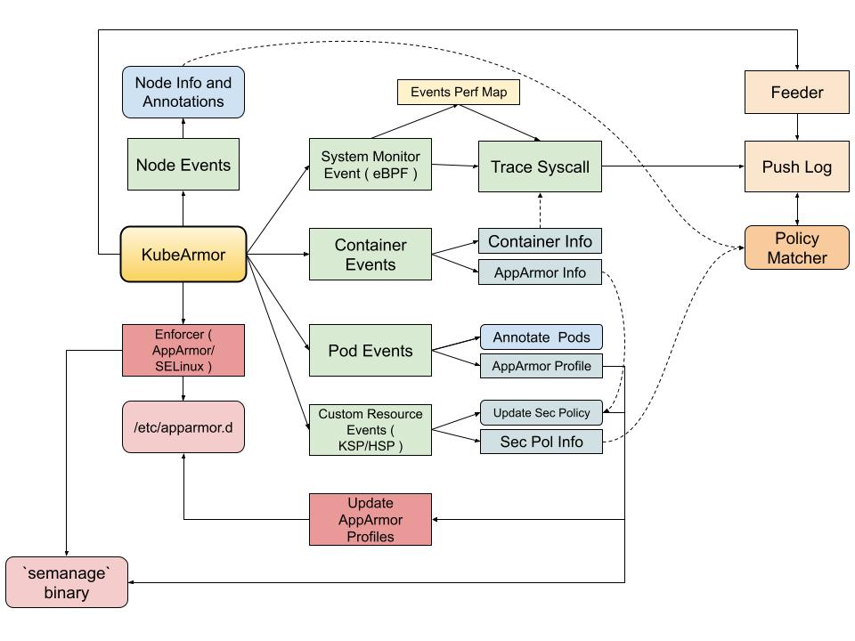 |   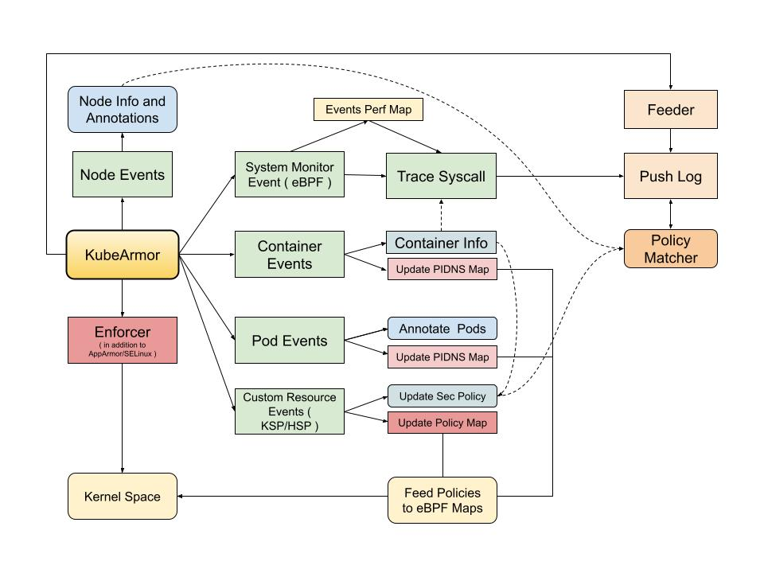   |

### Module Design

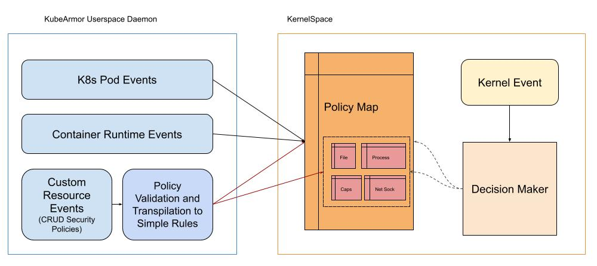

### Map Design

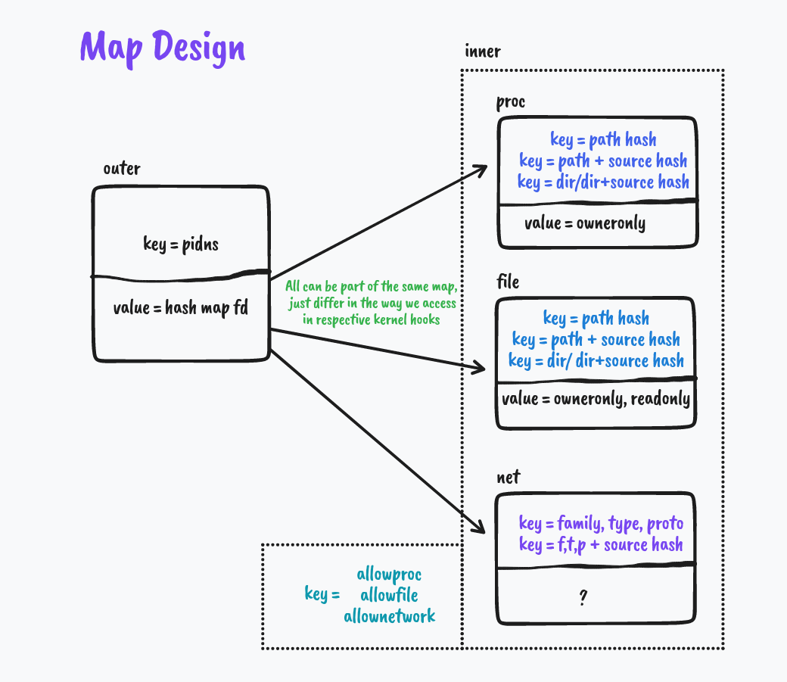

#### Outer Map details

```golang
struct outer_hash {
  __uint(type, BPF_MAP_TYPE_HASH_OF_MAPS);
  __uint(max_entries, X);
  __uint(key_size, sizeof(struct outer_key));    // 2*u32
  __uint(value_size, sizeof(u32));               // Inner Map File Descriptor
  __uint(pinning, LIBBPF_PIN_BY_NAME);           // Created in Userspace, Identified in Kernel Space using pinned name
};
```

* Key
    * Identifier for Containers

```golang
struct outer_key {
  u32 pid_ns;
  u32 mnt_ns;
};
```

#### Inner Map details

```golang
&ebpf.MapSpec{
    Type:       ebpf.Hash,
    KeySize:    4,            // Hash Value of Entity
    ValueSize:  8,            // Decision Values
    MaxEntries: 1024,
    }
```

* Value 

```golang
struct data_t {
  bool owner;        // owner only flag
  bool read;         // read only flag 
  bool dir;          // policy directory flag
  bool recursive;    // directory recursive flag
  bool hint;         // policy directory hint
};
```

### Handling of Events

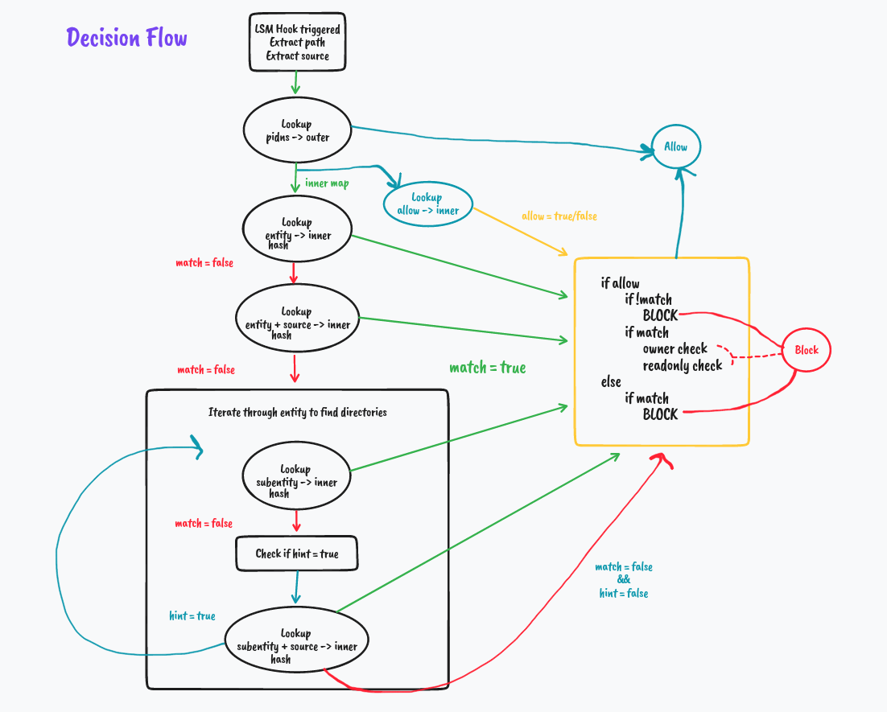

### Deeper Dive with Examples

1. 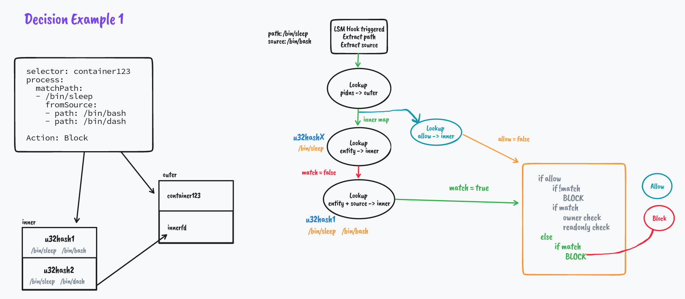

2. 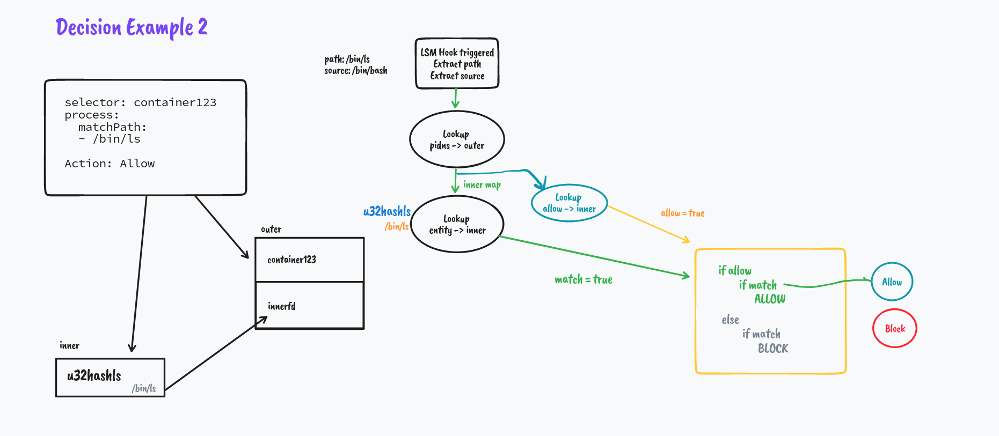
But what if it's not a match
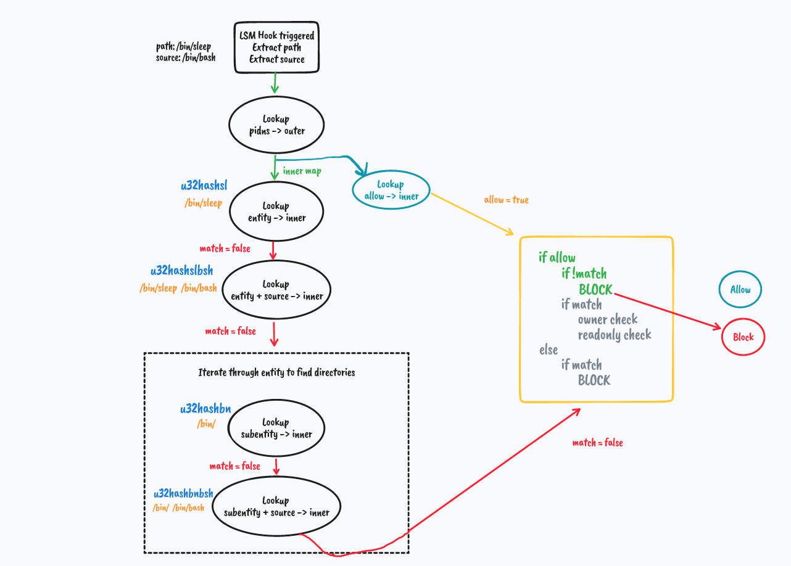
We explore how directory matching works in the next example

3. 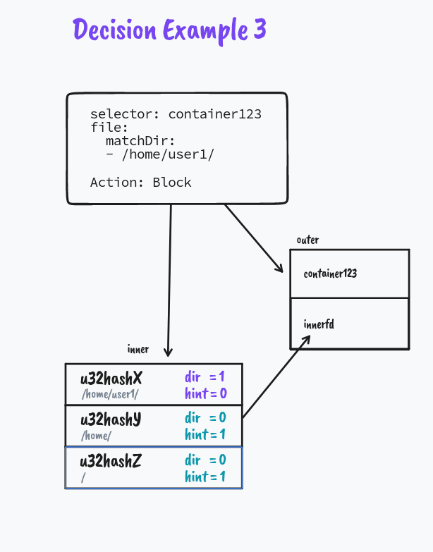<br/>
   Notice How we split the directory policy to a sets of hints in the map. This helps in efficient matching of directory paths in Kernel Space.
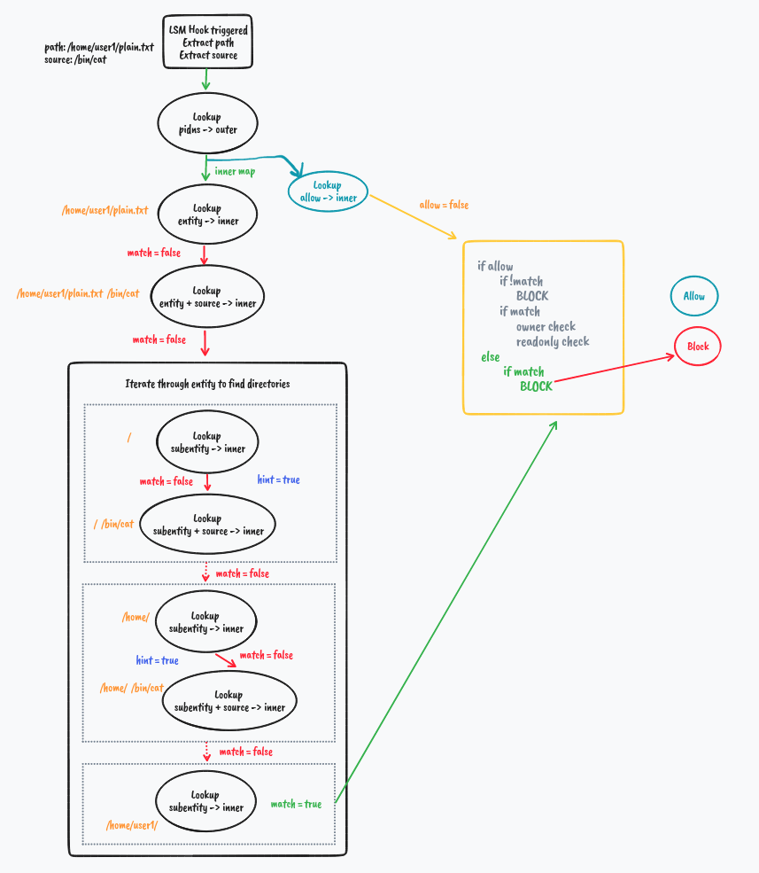<br/>
What if we try to access a file in a different directory.<br/>
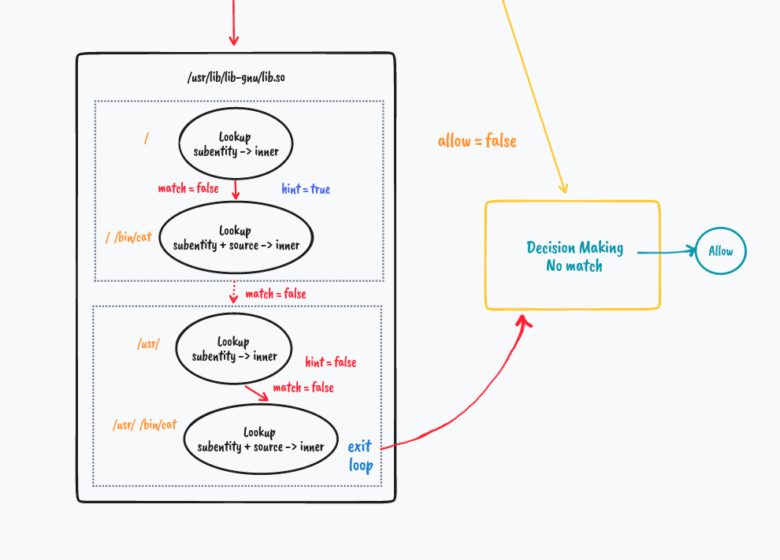<br/>
Presence of no hint helps break through the iteration hence optimizing the process.

#### Directory Matching

```golang
#pragma unroll
  for (int i = 0; i < MAX_STRING_SIZE; i++) {
    if (path[i] == '\0')
      break;

    if (path[i] == '/') {
      __builtin_memset(&dir, 0, sizeof(dir));
      bpf_probe_read_str(&dir, i + 2, path);

      fp = jenkins_hash(dir, i + 1, 0);

      struct data_t *val = bpf_map_lookup_elem(inner, &fp);
      if (val) {
        if (val->dir) {
          matched = true;
          goto decisionmaker;
        }
        if (val->hint == 0) { // If we match a non directory entity somehow
          break;
        }
      } else {
        break;
      }
    }
  }
```

### Hashing

Files and Source Names can be huge. Worst case both add to 8192 bytes. Which is a very large entity for key. So we hash that value to u32 key. We stored hashed values from userspace and lookup up hashed values from kernel space for decision making.

We plan to use a Jenkins hash algorithm modified for use in ebpf land and matching implementation in user land.

[Based on Event Auditor Implementation](https://github.com/kubearmor/KubeArmor/blob/990a852c88ab580011bde8a72adba33625ffcacd/KubeArmor/BPF/hash.h)

Inspirations

* https://en.wikipedia.org/wiki/Jenkins_hash_function
* http://burtleburtle.net/bob/c/lookup3.c
* https://github.com/tildeleb/hashland/blob/46daf2d89bba924a4269f30949050748548effb1/jenkins/jenkins.go
  
### TODO/ToCheck

1. List out LSM Hooks to be integrated with
2. Explore Hashing
3. Analyse Performance Impact
4. ...

### Miscellaneous Notes

* **Pattern Matcher**

    * AppArmor has it's own DFA based regular expression matching engine https://elixir.bootlin.com/linux/latest/source/security/apparmor/match.c
    * Geyslan's ebpf pattern matcher : https://github.com/geyslan/ebpf-pattern/tree/a-story-of-two-maps

* **LSM Hooks**

    * AppArmor LSMs: https://elixir.bootlin.com/linux/latest/source/security/apparmor/lsm.c#L1188
    * SELinux LSMs: https://elixir.bootlin.com/linux/latest/source/security/selinux/hooks.c#L7014
    * Program Exec Ops: https://elixir.bootlin.com/linux/latest/source/include/linux/lsm_hooks.h#L35
    * Task Ops: https://elixir.bootlin.com/linux/latest/source/include/linux/lsm_hooks.h#L604
    * File Ops: https://elixir.bootlin.com/linux/latest/source/include/linux/lsm_hooks.h#L507
    * Inode Ops: https://elixir.bootlin.com/linux/latest/source/include/linux/lsm_hooks.h#L213
    * Socket Ops: https://elixir.bootlin.com/linux/latest/source/include/linux/lsm_hooks.h#L842
  
* **Papers/TechDocs**

    * LSM https://www.kernel.org/doc/ols/2002/ols2002-pages-604-617.pdf
    * AppArmor https://lkml.iu.edu/hypermail/linux/kernel/0706.1/0805/techdoc.pdf
    * SELinux https://www.nsa.gov/portals/75/images/resources/everyone/digital-media-center/publications/research-papers/implementing-selinux-as-linux-security-module-report.pdf
    * BPFBox https://www.cisl.carleton.ca/~will/written/conference/bpfbox-ccsw2020.pdf
    * [Mitigating Attacks on a Supercomputer with KRSI](https://www.sans.org/white-papers/40010/)