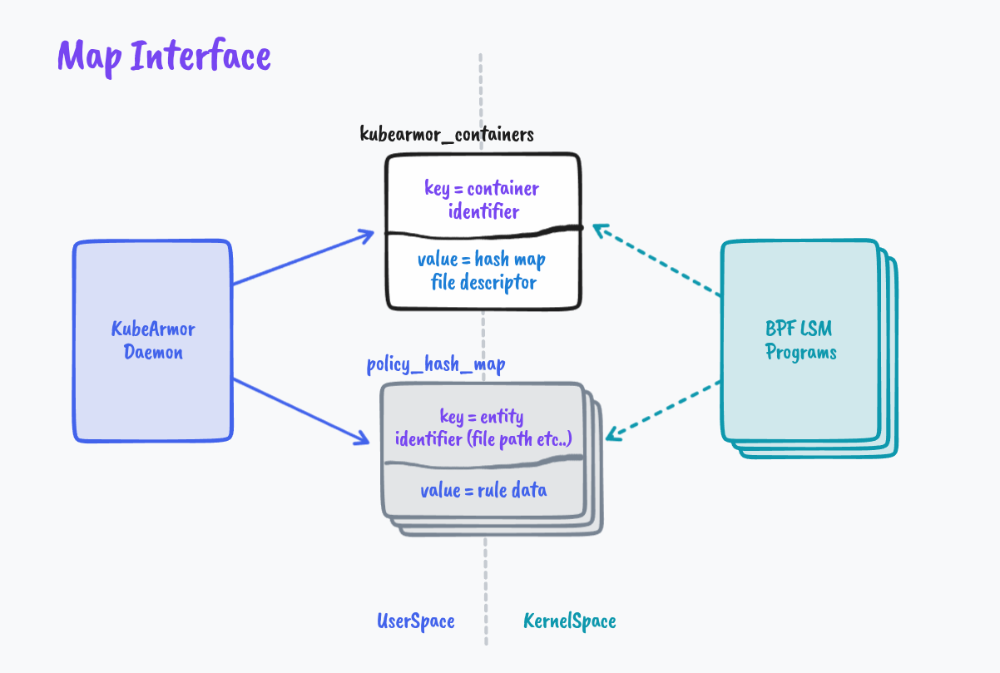
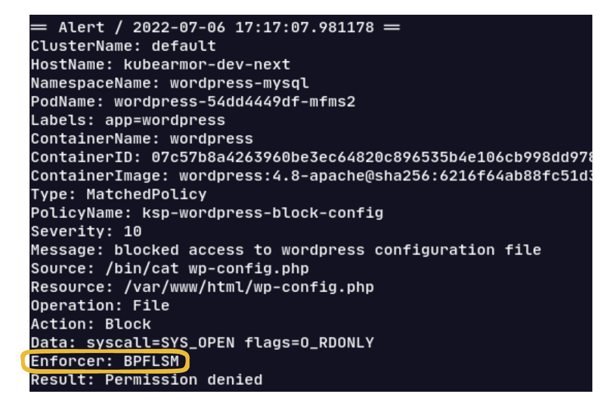

A few months back I presented at Cloud Native eBPF Day Europe 2022 about [Armoring Cloud Native Workloads with BPF LSM](https://www.youtube.com/watch?v=uYVaiIX7QC0) and planted a thought about building a holistic tool for runtime security enforcement leveraging BPF LSM. I have spent the past few weeks collaborating with the rest of the team at KubeArmor to realize that thought. This blog post will explore the why’s and how’s of implementing security enforcement as part of KubeArmor leveraging BPF LSM superpowers at its core.

## Why❓

Linux Security Modules provides with security hooks necessary to set up the least permissive perimeter for various workloads. A nice [introduction to LSMs here](https://blog.accuknox.com/an-introduction-to-linux-security-modules/).

[KubeArmor](https://github.com/kubearmor/KubeArmor/) is a cloud-native runtime security enforcement system that leverages these LSMs to secure the workloads.

LSMs are really powerful but they weren’t built with modern workloads including Containers and Orchestrators in mind. Also, the learning curve of their policy language seems to be steep thus imposing friction in adoption.

eBPF has provided us with the ability to safely and efficiently extend the kernel’s capabilities without requiring changes to kernel source code or loading kernel modules.

BPF LSM leverages the powerful LSM framework while providing us with the ability to load our custom programs with decision-making into the kernel seamlessly helping us protect modern workloads with enough context while we can choose to keep the interface easy to understand and user-friendly.

KubeArmor already integrates with AppArmor and SELinux and has a set of tools and utilities providing a seamless experience for enforcing security but these integrations come with their own set of complexities and limitations. Thus the need to integrate with BPF LSM would provide us with fine-grained control over the LSM hooks.

## How✍️

The Implementation can be conveyed by the following tales:

1. **Map to cross boundaries** - Establishing the interface between KubeArmor daemon (Userspace) and BPF Programs (KernelSpace)
2. **Putting Security on the Map** - Handling Policies in UserSpace and Feeding them into the Map
3. **Marshal Law** - Enforcing Policies in the KernelSpace

### Map to cross boundaries🗺️

There’s a clear boundary between the territories of KernelSpace and the Userspace, so how do we establish the routes between these two.

We leverage eBPF Maps for establishing the interface between the KubeArmor daemon (Userspace) and BPF Programs (KernelSpace). As described in the kernel doc,

```markdown
‘maps’ is a generic storage of different types for sharing data between kernel and userspace.
```

It seems apt to help us navigate here 😁

For each container KubeArmor needs to protect or how I like to term it ‘**Armor Up**’ the workload, we create an entry in the global BPF Hash of Maps pinned to the BPF filesystem under ```/sys/fs/bpf/kubearmor_containers```, this entry has a value to another BPF Hashmap which has all the details of policies that are needed to enforce.



### Putting Security on the Map📍

KubeArmor Security Policies have a lot of metadata, We cannot put all that to Maps and let the BPF Program navigate those complexities.

For instance, we usually map the security policies through labels associated with Pods and Containers. But we can’t send that to the BPF Program, let alone labels eBPF programs wouldn’t handle container names/IDs as well. So KubeArmor extracts information from Kubernetes and CRI (Docker/Containerd/CRI-O) APIs and simplifies it to something we can extract in the eBPF Program as well.

```golang
struct key {
  u32 pid_ns;
  u32 mnt_ns;
};

struct containers {
  __uint(type, BPF_MAP_TYPE_HASH_OF_MAPS);
  __uint(max_entries, X);
  __uint(key_size, sizeof(struct key));          // 2*u32
  __uint(value_size, sizeof(u32));               // Rule Map File Descriptor
  __uint(pinning, LIBBPF_PIN_BY_NAME);           // Created in Userspace, Identified in Kernel Space using pinned name
};
```

Similarly, KubeArmor can receive conflicting policies, we need to handle and resolve them as part of KubeArmor Userspace program before putting them on the Map.

After all the rule simplification, conflict resolution, and handling of policy updates, We send the data to the eBPF Map prepping the BPF Programs to get ready for enforcement.

### Marshal Law

We finally marshal all the data in the kernel space and impose MAC (Military Access Control? 🔫 *Pun intended :P )*.

In the kernel space where our BPF LSM Programs reside, In each program, we extract the main entity i.e. File Path, Process Path, or Network Socket/Protocol, and pair them up with their parent process paths and look up in the respective maps. We do the decision making based on these lookup values.

There are a fair bit of complexities involved here which I have skipped, if you are interested in them, check out [Design Doc](https://github.com/kubearmor/KubeArmor/wiki/KubeArmor-BPF-LSM-Integration#handling-of-events=) and [Github Pull Request](https://github.com/kubearmor/KubeArmor/pull/741).

I would also like to credit [How systemd extended security features with BPF LSM](https://kinvolk.io/blog/2021/04/extending-systemd-security-features-with-ebpf/) which acted as an inspiration for the implementation design.

## Armoring Up

The environment requires a kernel `>= 5.8` configured with `CONFIG_BPF_LSM`, `CONFIG_DEBUG_INFO_BTF` and the BPF LSM enabled (via `CONFIG_LSM="...,bpf"` or the `"lsm=...,bpf"` kernel boot parameter).

You can use the `daemon1024/kubearmor:bpflsm` image and follow the [Deployment Guide](https://github.com/kubearmor/KubeArmor/blob/main/getting-started/deployment_guide.md) to try it out.

A sample alert here showing enforcement through BPF LSM:


## Next Steps

We have unraveled just a drop of what BPF LSM is capable of, and we plan to extend our security features to lots of other use cases and BPF LSM would play an important role in it.

Near future plans include supporting wild cards in Policy Rules and doing in-depth performance analysis and optimizing the implementation.

**👋**<br/>
That sums up my journey to implement security enforcement leveraging BPF LSM at its core. It was a lot of fun and I learned a lot. Hope I was able to share my learnings 😄

If you have any feedback about the design and implementation feel free to comment on the [Github PR](https://github.com/kubearmor/KubeArmor/pull/741). If you have any suggestions/thoughts/questions in general or just wanna say hi, my contact details are [here](https://barun.cc/contact) ✌️