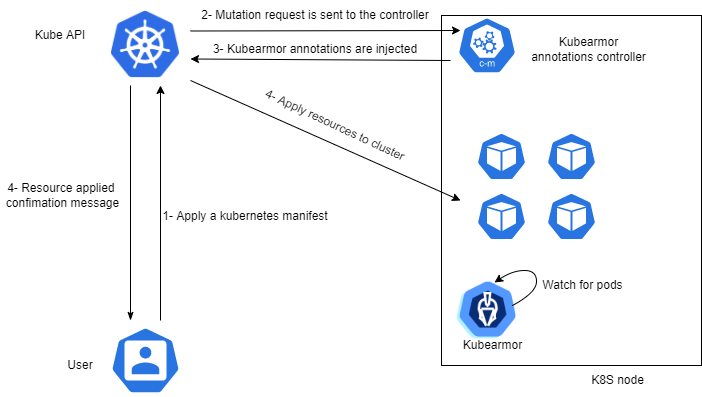

## KubeArmor annotation controller

Starting from version 0.5, kubearmor leverages admission controllers to support policy enforcement on a wide range of Kubernetes workloads such as individual pods, jobs, statefulsets, etc … .

### What is an admission controller?

An admission controller is a piece of code that intercepts requests to the Kubernetes API server prior to persistence of the object(1). Admission controllers can be one of two types:

* Validating admission controllers: used to either accept or reject an action on a resource, e.g: reject creation of pods in the default namespace. Kubernetes comes shipped with many validating controllers such as NodeRestriction controller that limits what kubelet can modify.
* Mutation admission controllers: used to apply modifications on requests prior to persistence, e.g: add default resource requests if they are not defined by a user. AWS EKS uses mutation controllers to add environment variables(region, node name, …) to each created container.

The order of admission controllers executions is as follow:

* All mutations are performed on the original request then merged, if a conflict occurs an error is yielded. Only the schema of the resultant merge is validated.
* All validating controllers are called, the request will be rejected if one validating controller rejects the request.

KubeArmor leverages mutation controllers to enable policy enforcement on kubernetes workload.

### What are the benefits of the annotation controller?

Before v0.5, policies were enforced by applying the appropriate annotations to pods by patching their parent deployment. This meant that policies can be applied only to pods that are being controlled by deployments.

By using mutation controllers we are able to extend kubearmor capabilities to support basically all types of workloads as the annotations will be applied to any pod prior to their creation, as a result, kubearmor will send far less requests to the API server as patch operations were executed in parallel and often in a concurrent manner by all kubearmor pods.

### What if the controller fails?

KubeArmor maintains the old annotation logic as a fallback logic in order to enable our users to continue to benefit from kubearmor policy enforcement but at a degraded level in case of a failure, details can be found at the event section of the newly created pods.

### How can I install it?

The controller comes bundled with kubearmor, you can install it via karmor cli tool or via our installation manifests under /deployments.

### What are the Kubernetes versions that can support the new controller?

The controller can be run on kubernetes clusters starting from v1.9 on newer. Please keep in mind that kubernetes only support the three latest versions of kubernetes.

### References

[Kubernetes documentation](https://kubernetes.io/docs/reference/access-authn-authz/admission-controllers/#what-are-they)(1)
