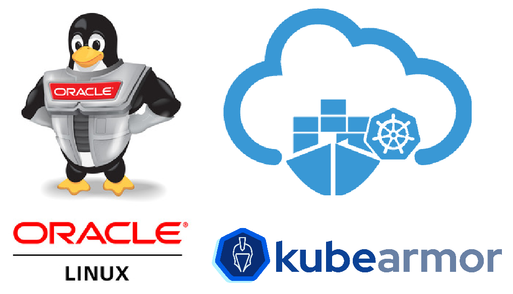
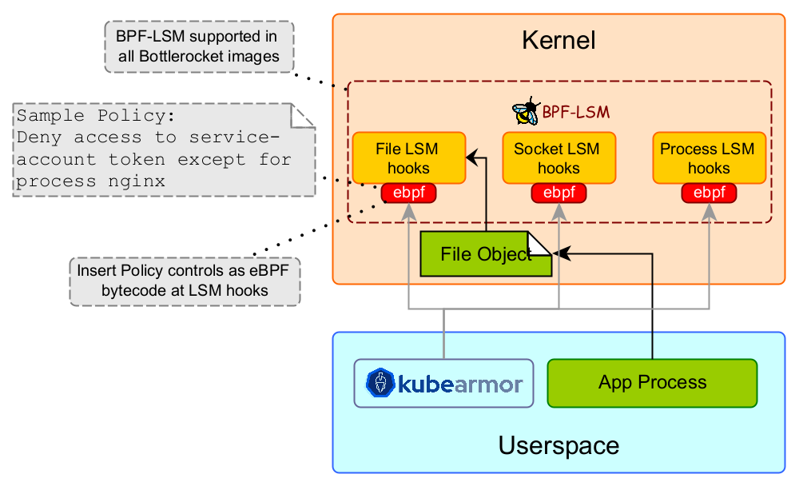

## Introduction

Oracle Container Engine for Kubernetes (OKE) is a managed [Kubernetes](https://www.oracle.com/cloud-native/container-engine-kubernetes/what-is-kubernetes/) service for operating containerized applications at scale while reducing the time, cost, and operational burden of managing the complexities of Kubernetes infrastructure. Container Engine for Kubernetes enables you to deploy Kubernetes clusters instantly and ensure reliable operations with automatic updates, patching, scaling, and more.

[Oracle Linux](https://www.oracle.com/linux/) is a distribution of Linux developed and maintained by Oracle and is primarily used on OKE. It is based on the Red Hat Enterprise Linux (RHEL) distribution and is designed to provide a stable and secure environment for running enterprise-level applications. Oracle Linux includes Unbreakable Enterprise Kernel (UEK) which delivers business-critical performance and security optimizations for cloud and on-premises deployment.

### Supporting KubeArmor on Oracle Linux

While UEK (Unbreakable Enterprise Kernel) is a heavily fortified kernel image, the security of the pods and the containers are still the responsibility of the application developer. [KubeArmor](https://kubearmor.io/), a CNCF (Cloud Native Computing Foundation) sandbox project, is a runtime security engine that leverages extended Berkeley Packet Filter (eBPF) and Berkeley Packet Filter-Linux Security Module (BPF-LSM) to protect the pods and containers.

With [version 0.5](https://github.com/kubearmor/KubeArmor/wiki/v0.5-Release-Blog), KubeArmor integrates with BPF-LSM for pod and container-based policy enforcement. BPF-LSM is a new LSM ([Linux Security Modules](https://github.com/kubearmor/KubeArmor/wiki/Introduction-to-Linux-Security-Modules-(LSMs))) that’s introduced in the newer kernels (version > 5.7). BPF-LSM allows KubeArmor to attach bpf-bytecode at LSM hooks that contain user-specified policy controls.

KubeArmor provides enhanced security by using BPF-LSM to protect k8s pods hosted on OKE by limiting system behavior with respect to processes, files, and the use of network primitives. For example, a k8s service access token that’s mounted within the pod is accessible by default across all the containers within that pod. KubeArmor can restrict access to such tokens only for certain processes. Similarly, KubeArmor is used to protect other sensitive information (e.g., k8s secrets, x509 certificates) within the container. You can specify policy rules in KubeArmor such that any attempts to update the root certificates in any of the certificate’s folders (i.e., `/etc/ssl/`, `/etc/pki/`, or `/usr/local/share/ca-certificates/`) can be blocked. Moreover, KubeArmor can restrict the execution of certain binaries within the containers.

### To Summarize

KubeArmor, a cloud-native solution now supports OKE to secure pods and containers using BPF-LSM for inline attack mitigation/prevention. In the case of k8s, the pods are the execution units and are usually exposed to external entities. Thus, it’s imperative to have a layer of defense within the pods so that the attacker is limited in their ability to use system primitives to exploit the vulnerability. KubeArmor is a k8s-native solution that uses Linux kernel primitives on Unbreakable Enterprise Kernel (UEK) to harden the pods, further fortifying the K8s engine.