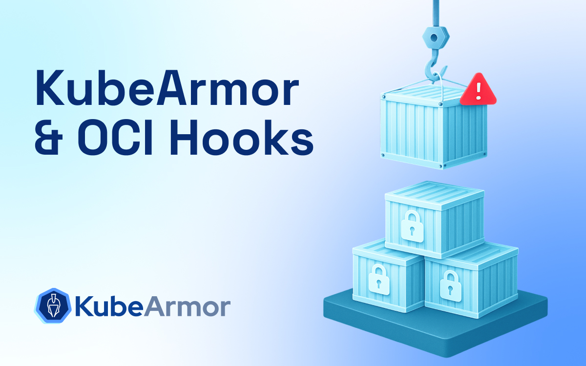
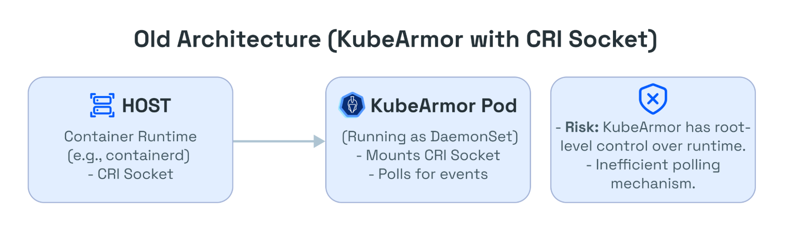
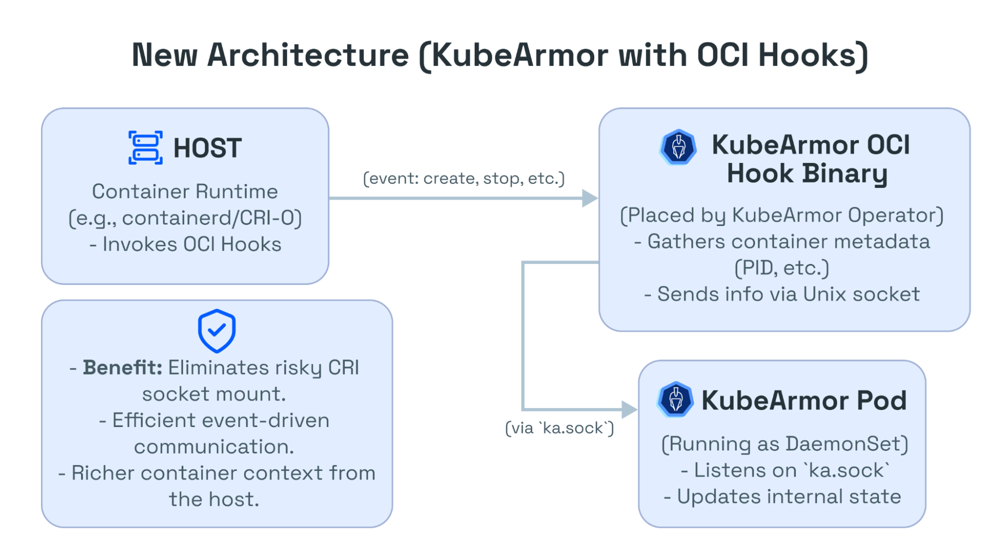
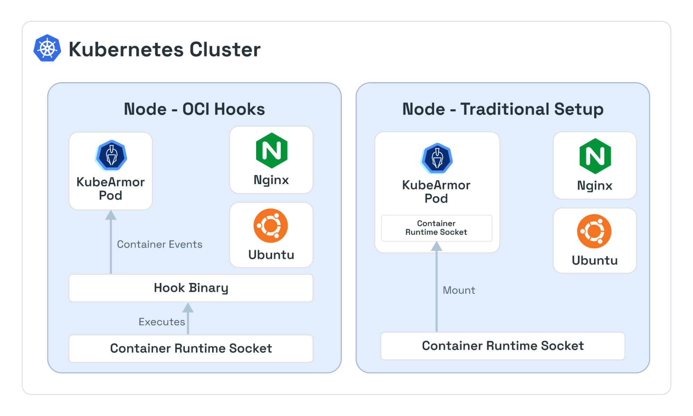

# KubeArmor and OCI Hook for Enhanced Container Runtime Security

## Why OCI Hooks Matter in Modern Cloud Workloads

#### What are OCI Hooks?

OCI (Open Container Initiative) hooks are standard, custom binaries that the container runtime executes at specific points in a container’s lifecycle.

#### Lifecycle of a Container with OCI Hooks

In practice, when a container runtime (like CRI-O or containerd) launches a container, it consults the OCI configuration (or NRI plugin) and executes any configured hooks at the appropriate stages.

- **Create runtime**: After the runtime unpacks the container image and sets up namespaces, it runs the create runtime hook. For example, this could be used to register the container with monitoring tools.

- **Poststop**: When the container process exits, the poststop hook is run. For example, this function can log the shutdown or trigger cleanup.

The OCI spec mandates hooks be executed in order, and the container’s state is passed via `stdin`, allowing the hook to identify the container (by ID, metadata, etc.).

> ⚠️ **Note**: A hook execution failure can abort container creation.

## Why KubeArmor Introduced OCI Hooks Support

Before OCI hooks, KubeArmor obtained container events by mounting the container runtime’s Unix socket inside its pod and polling it.

- This has serious **security drawbacks**:
  - Access to the CRI socket allows creating/deleting containers
  - Breaks container isolation
  - Is considered a security flaw

OCI hooks eliminate this dependency by giving KubeArmor event-driven access to container lifecycle data—**securely**.

## How KubeArmor Integrates with OCI Hooks

- KubeArmor is typically deployed as a **DaemonSet** on each node.
- It uses **eBPF** programs attached to **LSM hooks** (AppArmor/SELinux) to monitor syscalls.
- For OCI hook support:
  - A **hook binary** is placed on the host by the KubeArmor Operator.
  - Its path is configured in the runtime’s hook JSON.
  - On a container lifecycle event, the runtime invokes the hook binary.
  - This binary collects container info (PID, namespace IDs, AppArmor profile) from `/proc`.
  - It sends the info to the KubeArmor daemon over a Unix socket (`ka.sock`).
  - KubeArmor then registers/unregisters the container in real time.

> ✅ All without mounting or polling any CRI runtime socket.

## Use Cases Enabled by OCI Hooks

- **Eliminate Socket Privileges**:
  No need for privileged access to CRI sockets → drastically improved security.

- **Richer Context**:
  Hook runs on host → accesses container configuration directly (AppArmor/SELinux, namespaces, image layers).

- **Broader Environment Coverage**:
  Works even in environments where CRI sockets aren’t accessible (as long as OCI hooks are supported).

## Roadmap: What’s Next for OCI Hooks in KubeArmor

OCI hooks support is **currently experimental**. Future plans include:

- **Auto Deploy NRI Injector**

  - Automate deployment via KubeArmor Operator
  - Eliminate manual installation of NRI on every node

- **Broader Runtime Support**
  - Add **Podman** support using OCI hooks
  - Use hooks as a default integration pattern for new runtimes

## References & Resources

- 📘 [KubeArmor GitHub](https://github.com/kubearmor/KubeArmor)
- 📄 [Official Docs: KubeArmor with OCI Hooks](https://github.com/kubearmor/KubeArmor/blob/main/wiki/oci_hooks_kubearmor.md)
- 📚 [OCI Runtime Spec](https://github.com/opencontainers/runtime-spec)
