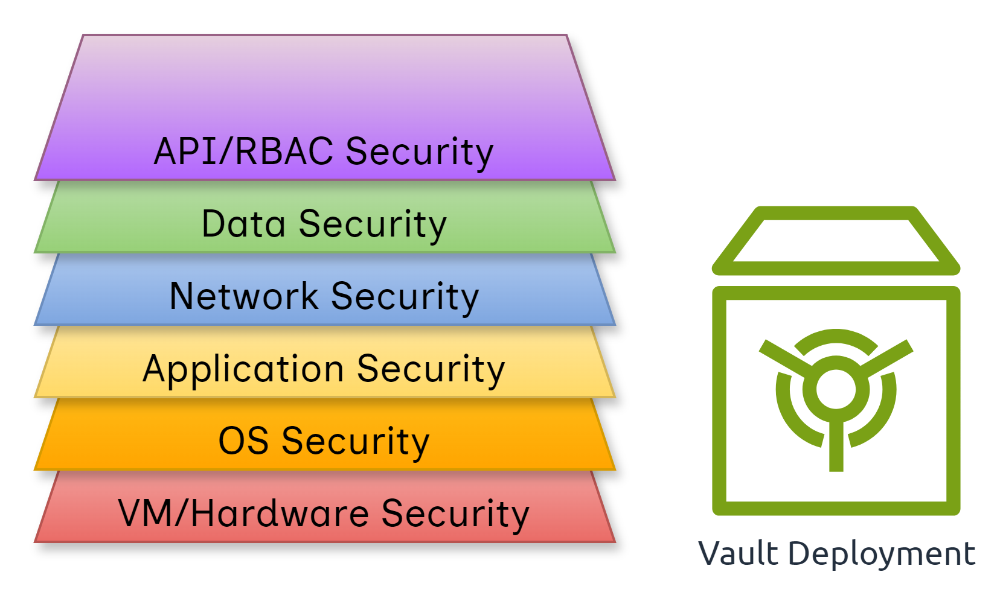

# KubeArmor and Confidential Containers for zero-trust security in Kubernetes environments

Enforcing security policies in a zero-trust environment presents a fundamental challenge: controls enforced on the host can be compromised or create unintended side effects for other workloads.

A more robust approach sandboxes the security enforcement mechanism within the workload runtime environment itself, ensuring policies are isolated and specific to the workload they protect.

The integration of **[KubeArmor’s](https://github.com/kubearmor/KubeArmor/) eBPF-based security** with **[Confidential Containers (CoCo)](https://github.com/confidential-containers)** achieves this isolated enforcement model. It details the proof-of-concept (PoC) architecture, policy enforcement mechanisms, and key security considerations for creating a zero-trust solution for sensitive workloads.

## Security Challenges in Confidential Environments

#### Vault Security

Securing secrets within a Kubernetes (K8s) environment is critical, and using a tool like HashiCorp Vault is a common best practice.

Vault stores highly sensitive data such as passwords, API tokens, access keys, and connection strings. A compromised vault can lead to severe consequences including ransomware attacks, organizational downtime, and reputational damage.

## Key Threat Models and Risks

| Threat Model               | Threat Vector(s)                                                                                                                                 | Remediation                                                                 |
|-----------------------------|--------------------------------------------------------------------------------------------------------------------------------------------------|----------------------------------------------------------------------------|
| 👤 **User Access Threats** | An attacker compromises a legitimate user’s endpoint or credentials to impersonate them and access the Vault.                                    | • Implement MFA • Enforce least privilege                              |
| 🖥️ **Server Threats**     | • Lateral movement from another compromised service • Exploiting Vault vulnerability (e.g., RCE) to inspect memory or access secret volumes | • Use network segmentation • Disallow `kubectl exec` on Vault pods • Apply runtime security |
| 💻 **Client-Side Threats** | Authorized app retrieves a secret but stores it insecurely (e.g., plaintext, memory, disk, env var).                                             | • Ensure secure memory practices • Never persist secrets to disk/env   |

<div style={{ display: "flex", gap: "20px" }}>

  <figure style={{ flex: 1, textAlign: "center" }}>
    <figcaption><strong>User Access Threats</strong></figcaption>
    
  </figure>

  <figure style={{ flex: 1, textAlign: "center" }}>
    <figcaption><strong>Server Threats</strong></figcaption>
    

  </figure>

</div>

<figure style={{ textAlign: "center", marginTop: "20px" }}>
<figcaption><strong>Client-Side Threats</strong></figcaption>
  
</figure>

## The Need for Multi-Layered Security



Relying solely on **RBAC** is insufficient. A defense-in-depth strategy combining strong authentication, network segmentation, least-privilege access, and runtime protection is essential.

However, all protections assume the **control plane, worker nodes, and cluster admin are trusted**. If the cluster-admin itself is compromised, RBAC and network policies fail.

This is where **CoCo + KubeArmor integration** provides immutable policies, runtime protection, and data-in-use protection inside **hardware-backed enclaves**.

<div style={{ display: "flex", gap: "20px", alignItems: "center" }}>
  
  
</div>

## Integration Architecture

KubeArmor runs in **systemd mode** inside a **Kata VM**, ensuring policies are enforced directly within the confidential environment.

#### Key Components

* **Systemd Mode** – Runs as a service in the Kata VM with immutable policies.
* **Embedded Policies** – Bundled in the VM image, loaded at boot.
* **OCI Prestart Hook** – Initializes KubeArmor before workload execution.
* **VM Image Preparation** – KubeArmor binaries, configs, and units added to Kata VM image.


## Configuration Examples

#### `kubearmor.path`

```ini
[Unit]
Description=Monitor for /run/output.json and start kubearmor

[Path]
PathExists=/run/output.json
Unit=kubearmor.service

[Install]
WantedBy=multi-user.target
```

#### `kubearmor.service`

```ini
[Unit]
Description=KubeArmor

[Service]
User=root
KillMode=process
WorkingDirectory=/opt/kubearmor/
ExecStart=/opt/kubearmor/kubearmor /opt/kubearmor/kubearmor.yaml
Restart=always
RestartSec=10

[Install]
WantedBy=multi-user.target
```

## Policy Enforcement Mechanisms

<iframe
  src="https://drive.google.com/file/d/1YE1GLpfURqckG7KhzlGljYwZazLHeLYK/preview"
  width="840"
  height="480"
  allowfullscreen>
</iframe>


In the PoC, KubeArmor enforced **fine-grained policies** within the confidential container VM.

#### PoC Demo Summary

* **Blocked:** raw sockets, writing to `/bin`
* **Allowed:** unrestricted pod performed these actions successfully

✅ Validated runtime policy enforcement inside a confidential container.

#### Key Capabilities

* Restrict execution of raw sockets
* Block write operations to `/bin`, `/usr/bin`, `/boot`
* Wildcard-based selectors for all containers in Kata VM

## Policy Examples

#### Network Policy

```yaml
apiVersion: security.kubearmor.com/v1
kind: KubeArmorPolicy
metadata:
  name: net-raw-block
spec:
  selector:
    matchLabels:
      kubearmor.io/container.name: ".*"
  network:
    matchProtocols:
      - protocol: raw
  action: Block
```

#### File Integrity Policy

```yaml
apiVersion: security.kubearmor.com/v1
kind: KubeArmorPolicy
metadata:
  name: file-integrity-monitoring
spec:
  action: Block
  file:
    matchDirectories:
      - dir: /bin/
        readOnly: true
      - dir: /sbin/
        readOnly: true
  selector:
    matchLabels:
      kubearmor.io/container.name: ".*"
```

## Security Considerations

* **SPOF:** If `kubearmor.service` stops, enforcement halts.
* **API Path Restrictions:** Cannot block HTTP API paths yet.
* **PID-Specific Controls:** No support for blocking `stdout/stderr` for specific PIDs.

## Setup Guide: KubeArmor with Confidential Containers

#### Prerequisites

Kata Containers running in Kubernetes cluster.

#### 1. Build an eBPF-Enabled Kata Kernel

```bash
git clone https://github.com/kata-containers/kata-containers.git
cd kata-containers/tools/packaging/kernel
./build-kernel.sh -v 6.4 setup
mv kata-linux-6.4-135/.config kata-linux-6.4-135/.config_backup
cp kata-config kata-linux-6.4-135/.config
./build-kernel.sh -v 6.4 build
sudo ./build-kernel.sh -v 6.4 install
sudo sed -i 's|^kernel =.*|kernel="/usr/share/kata-containers/vmlinux.container"|' \
  /opt/kata/share/defaults/kata-containers/configuration-qemu.toml
```

#### 2. Prepare Kata VM Image for KubeArmor

Place KubeArmor binaries under:

```
cloud-api-adaptor/podvm-mkosi/resources/binaries-tree/opt/kubearmor/
```

Structure:

```
BPF/
kubearmor
kubearmor.yaml
policies/
templates/
```

Example `kubearmor.yaml`:

```yaml
k8s: false
useOCIHooks: true
hookPath: /run/output.json
enableKubeArmorStateAgent: true
enableKubeArmorPolicy: true
visibility: process,network
defaultFilePosture: audit
defaultNetworkPosture: audit
defaultCapabilitiesPosture: audit
alertThrottling: true
maxAlertPerSec: 10
throttleSec: 30
```

#### 3. Update Presets

File: `30-coco.preset`

```
enable attestation-protocol-forwarder.service
enable attestation-agent.service
enable api-server-rest.path
enable confidential-data-hub.path
enable kata-agent.path
enable netns@.service
enable process-user-data.service
enable setup-nat-for-imds.service
enable kubearmor.path
enable gen-issue.service
enable image-env.service
```

#### 4. Add Prestart Hook

Place `kubearmor-hook` under:

```
cloud-api-adaptor/podvm-mkosi/resources/binaries-tree/usr/share/oci/hooks/prestart
```

#### 5. Place Policies

```
cloud-api-adaptor/podvm-mkosi/resources/binaries-tree/opt/kubearmor/policies
```

Example:

```
protect-env.yaml
host-net-raw-block.yaml
host-file-integrity-monitoring.yaml
```

#### 6. Deploy & Test Policy Enforcement

```yaml
apiVersion: security.kubearmor.com/v1
kind: KubeArmorPolicy
metadata:
  name: block-mysql-data-access
spec:
  selector:
    matchLabels:
      app: mysql
  file:
    matchDirectories:
    - dir: /var/lib/mysql/
      recursive: true
  action: Block
```

Test:

```bash
kubectl exec -it [MYSQL_POD_NAME] -c mysql -- cat /var/lib/mysql/any-file
# Expected: Permission denied
```

## Challenges and Future Improvements

* Wildcard selectors fixed fragility of container-name-based policies
* Need daemonless policy persistence to mitigate SPOF
* Enhance support for dynamic policy updates via CoCo [initdata](https://github.com/confidential-containers/trustee/blob/main/kbs/docs/initdata.md)
* Path-based network and process output restrictions pending kata-agent integration
* Validate on production CoCo/Kata environments
* Protect against service termination attacks inside enclaves

## Acknowledgements

This work was made possible through close collaboration with the [Confidential Containers (CoCo) community](https://github.com/confidential-containers). We thank all contributors and maintainers for their guidance, feedback, and support throughout the development and integration process.
