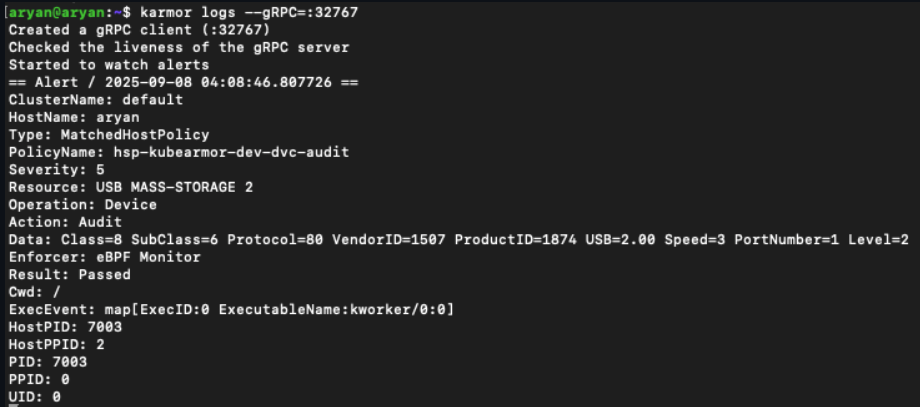
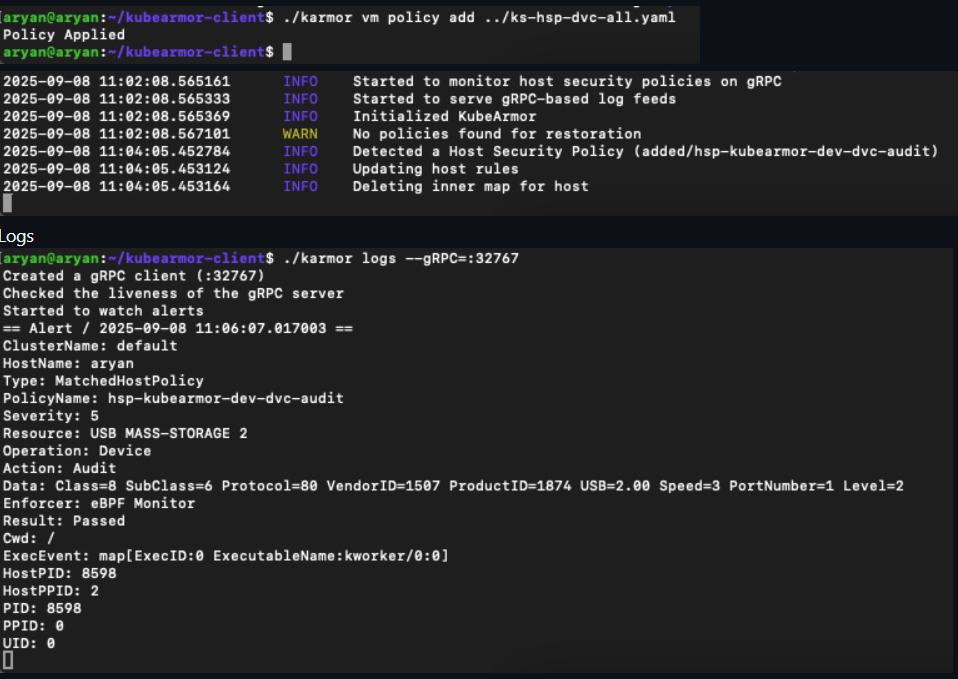

# Introducing USB Device Enforcement for Host Security

We're excited to announce a powerful new security capability in KubeArmor: **USB Device Audit and Enforcement**, now available in KubeArmor Host Policies. This feature, introduced in [PR \#2194](https://github.com/kubearmor/KubeArmor/pull/2194) and tracking [Issue \#2165](https://github.com/kubearmor/KubeArmor/issues/2165), significantly extends KubeArmor's runtime security scope, moving beyond processes, files, and networks to secure the physical hardware layer of your nodes and VMs.

> **Want to see it in action? Check out this demo video:**

<iframe width="650" height="415" src="https://www.youtube.com/embed/NDguhHUBpqk" title="USB Device Enforcement Demo" frameborder="0" allow="accelerometer; autoplay; clipboard-write; encrypted-media; gyroscope; picture-in-picture; web-share" allowfullscreen></iframe>


## How USBs are a Physical Attack Vector

In any secure environment, physical access is a critical threat vector. USB devices, while ubiquitous, introduce substantial risks:

  * **Data Exfiltration:** Unauthorized USB mass storage devices can be used to easily copy and steal sensitive data.
  * **Malicious Peripherals:** Devices posing as keyboards (like "BadUSBs") can execute key-logging attacks or inject malicious commands.
  * **Firmware-Based Attacks:** Sophisticated attacks can target the device firmware itself.

Controlling which devices can be attached to a host is a critical part of a defense-in-depth strategy and a common requirement for regulatory compliance.

## The Solution - The KubeArmor USB Device Handler

The new USB Device Handler gives you granular, policy-based control over USB devices at the host level. You can now create KubeArmor Host Policies to **audit** (log) or **block** (deauthorize) specific devices or entire classes of devices based on their attributes.


## How It Works Under the Hood

To provide robust, low-level control, the USB Device Handler operates by directly interacting with the Linux kernel:

1.  **Monitoring Kernel U-events:** The handler listens to kernel **U-events** via a Netlink socket. The kernel emits these events whenever a USB device is attached or removed.
2.  **Device Enumeration:** When a device is attached, the kernel enumerates it, reading its descriptors to identify its `class`, `subClass`, `protocol`, and other attributes. This information is included in the U-event.
3.  **Policy Matching:** The USB Device Handler receives this U-event and matches the device's attributes against all applied `KubeArmorHostPolicy` resources.
4.  **`sysfs` Enforcement:** Based on the policy's action (`Audit` or `Block`), the handler enforces control using **`sysfs`-based authorization**.
      * It writes a `1` (authorize) or `0` (deauthorize) to the device's `authorized` file within the `sysfs` pseudo-file system (e.g., `/sys/bus/usb/devices/.../authorized`).
      * Writing `0` instantly deauthorizes the device, unbinding its drivers and making it unusable by the system, effectively blocking it.

This mechanism ensures that even if a device is physically plugged in, it cannot be accessed or used by the host operating system if a "Block" policy is in place.

## Configuration and Setting Up the USB Device Handler

To enable this feature, you need to update your KubeArmor configuration.

1. **Enable the Handler:** You must set two flags to `true`:

      * `enableKubeArmorHostPolicy: true`
      * `enableUSBDeviceHandler: true`

    If you are running KubeArmor in Kubernetes, you will need to patch the DaemonSet. For systemd (non-Kubernetes) mode, you will add these flags to your configuration file.

2. **Set the Default Posture:**
   A new flag, `hostDefaultDevicePosture`, is also available.
   This flag (which defaults to `audit`) determines the action KubeArmor will take on devices that do not match any policy **when running in allow-list mode** (when there is at least one allow-based policy applied).

      * `audit` (Default): Unmatched devices are audited.
      * `block`: Unmatched devices are automatically blocked.


## Monitoring Device Events

You can easily monitor USB device alerts and logs using the `karmor` CLI:

```bash
# Listen for device-specific operations (both logs and alerts)
karmor log --operation device --log-filter all
```


## Policy in Action - Use Cases

A new `device` block is now available in the `KubeArmorHostPolicy` spec. You can match devices based on `class`, `subClass`, `protocol`, and `level` (attachment level).

**Example 1: Audit All Mass Storage Devices**

This policy creates an `Audit` alert every time a USB mass storage device is attached. This is perfect for gaining visibility and meeting compliance requirements without being disruptive.

```yaml
apiVersion: security.kubearmor.com/v1
kind: KubeArmorHostPolicy
metadata:
  name: hsp-device-mass-storage-audit
spec:
  nodeSelector:
    matchLabels:
      kubernetes.io/hostname: your-node-name # Target a specific node
  severity: 5
  device:
    matchDevice:
    # Class can be a string (e.g., "MASS-STORAGE")
    # or its numeric ID (e.g., 8)
    - class: MASS-STORAGE
  action: Audit # Logs the event
```

**Example 2: Block All Mass Storage Devices**

To prevent data exfiltration, you can simply change the `action` to `Block`.

```yaml
apiVersion: security.kubearmor.com/v1
kind: KubeArmorHostPolicy
metadata:
  name: hsp-device-mass-storage-block
spec:
  nodeSelector:
    matchLabels:
      kubernetes.io/hostname: your-node-name
  severity: 8 # Higher severity for a block
  device:
    matchDevice:
    - class: MASS-STORAGE
  action: Block # Blocks the device
```

**Example 3: Block Specific Malicious-Type Devices (e.g., Keyboards)**

This policy demonstrates how to use more granular fields to block devices that identify as a keyboard (a common vector for BadUSB attacks).

```yaml
apiVersion: security.kubearmor.com/v1
kind: KubeArmorHostPolicy
metadata:
  name: hsp-device-hid-keyboard-block
spec:
  nodeSelector:
    matchLabels:
      kubernetes.io/hostname: your-node-name
  severity: 10
  device:
    matchDevice:
    - class: HID      # Human Interface Device
      subClass: 1     # Boot Interface Sub-class
      protocol: 1     # Keyboard
  action: Block
```

**Policy Specificity Matters**

The USB Device Handler respects policy priority: **the most specifically defined policy wins**.

For example, if you have two policies:

1.  `Block class: MASS-STORAGE`
2.  `Allow class: MASS-STORAGE, subClass: 6, protocol: 80`

The handler will **allow** a device that matches the second, more specific policy (a mass storage device with subclass 6 and protocol 80), while still blocking all *other* mass storage devices. This allows you to create fine-grained allow-lists for specific, approved corporate devices.

## Policy In Action - Exact Match, Match All, Allow Based Examples

You can create policies using exact matches, match-all conditions, and allow-based approaches.

**Exact Match Example - Audit a Specific USB Device:**

```yaml
apiVersion: security.kubearmor.com/v1
kind: KubeArmorHostPolicy
metadata:
  name: hsp-kubearmor-dev-dvc-audit
spec:
  nodeSelector:
    matchLabels:
      kubernetes.io/hostname: aryan
  severity: 5
  device:
    matchDevice:
    - class: MASS-STORAGE
  action: Audit
```

Logs (after attaching a USB drive and 2 other USB devices):


**Match All Example - Block All USB Devices:**

```yaml
apiVersion: security.kubearmor.com/v1
kind: KubeArmorHostPolicy
metadata:
  name: hsp-kubearmor-dev-dvc-audit
spec:
  nodeSelector:
    matchLabels:
      kubernetes.io/hostname: aryan
  severity: 5
  device:
    matchDevice:
    - class: ALL
  action: Audit
```

Logs (after attaching 3 different USB devices):


**Allow Based Example**

```yaml
apiVersion: security.kubearmor.com/v1
kind: KubeArmorHostPolicy
metadata:
  name: hsp-kubearmor-dev-dvc-audit
spec:
  nodeSelector:
    matchLabels:
      kubernetes.io/hostname: aryan
  severity: 5
  device:
    matchDevice:
    - class: ALL
  action: Allow
```


**When No Policy is Set:**


**For non-k8s mode:**
```yaml
apiVersion: security.kubearmor.com/v1
kind: KubeArmorHostPolicy
metadata:
  name: hsp-kubearmor-dev-dvc-audit
spec:
  nodeSelector:
    matchLabels:
      kubearmor.io/hostname: aryan
  severity: 5
  device:
    matchDevice:
    - class: ALL
  action: Audit
```



## Conclusion

The new USB Device Enforcement feature brings critical, hardware-level runtime security to your KubeArmor-protected hosts. You can now gain full visibility into device events, prevent unauthorized USB access, and build a more resilient security posture against physical threats.

A special thanks to **[AryanBakliwal](https://github.com/AryanBakliwal)** for contributing this major feature.
