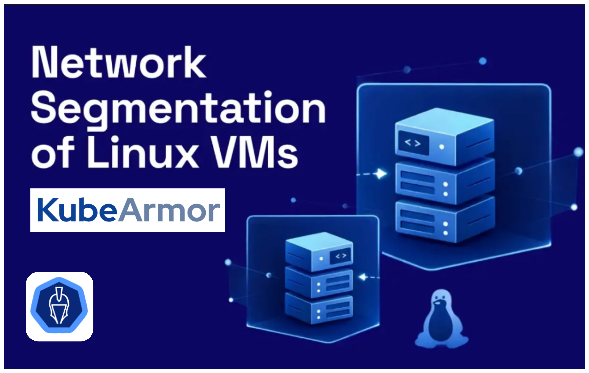

# Network Segmentation of Linux VMs using KubeArmor



KubeArmor now enforces layer 3/4 network rules on Linux VMs via a new CRD: `KubeArmorNetworkPolicy`. Policies support CIDR ranges, port ranges, interface scoping, and both ingress and egress control. Enforcement runs at the kernel via nftables and is stateful by default.

<!-- truncate -->

## The Gap That Hurt VM Security

KubeArmor already enforced process execution, file access, and protocol-level network syscalls on VMs. But layer 3 and layer 4 controls were missing. You could block a protocol, optionally filtered by process, but that was the ceiling.

You could not write: *accept TCP on port 5432 only from this CIDR, on this interface.* No ingress/egress port control. No IP block rules. No port ranges. `KubeArmorNetworkPolicy` closes that gap.

Network segmentation on Linux VMs has historically required either cloud security groups or a separately managed firewall tool. KubeArmor collapses both into a single policy plane that lives alongside your workload definitions.

In a segmented network, each VM zone (database tier, app tier, bastion) should only communicate with adjacent tiers on approved ports. Without kernel-level enforcement, those boundaries exist only on paper.

## What Is the Network Policy Enforcer?

A new feature that adds layer 3/4 network enforcement to KubeArmor for VMs. It introduces a dedicated CRD, `KubeArmorNetworkPolicy`, separate from the three existing policy types.

| **CRD** | **Target** | **Enforcement Layer** | **Use When** |
|---|---|---|---|
| `KubeArmorPolicy` | Containers / pods | Process, file, syscall, protocol+process | Container workload hardening |
| `KubeArmorHostPolicy` | VM / host | Process, file, syscall, protocol+process | Host-level process and file control |
| `KubeArmorNetworkPolicy` | VM / host nodes, K8s Nodes | Layer 3/4: CIDR, port, port range, interface | IP-based and port-based VM network control |


*Figure 1: KubeArmor policy CRD hierarchy and enforcement layers*

#### Under the Hood: nftables

KubeArmor translates `KubeArmorNetworkPolicy` rules into nftables rules on the host. It creates its own table named `KubeArmor`, with chains that hook into Linux's input and output hooks. Every applied policy becomes a rule inside those chains.

Two default rules are always present in every chain:

- **Loopback traffic is always allowed.** Services communicating locally over `lo` are not disrupted.
- **Established and related connections are accepted**, making the policy stateful. An ingress allow does not require a matching egress rule for reply packets.

> On startup, KubeArmor checks that nftables is present and running as root. If nftables is unavailable, the enforcer skips initialization. No silent failures.

#### Default Posture and Enabling the Feature

| **Setting** | **Behavior** |
|---|---|
| Default posture: Block | Traffic not matched by any policy is dropped. |
| Default posture: Audit | Unmatched traffic is logged only. No blocking. |
| `enableNetworkPolicyEnforcer: true` (default) | Feature active. `KubeArmorNetworkPolicy` resources are enforced. |
| `enableNetworkPolicyEnforcer: false` | Feature disabled. Existing CRDs unaffected. |

## Policy Structure

The spec mirrors Kubernetes `NetworkPolicy` with two additions: an `action` field and an `iface` field. Anyone familiar with K8s network policies will read these without friction.

```yaml
apiVersion: security.kubearmor.com/v1
kind: KubeArmorNetworkPolicy
metadata:
  name: [policy name]
spec:
  severity: [1-10]          # optional (appears in alerts)
  tags: ["tag", ...]        # optional (e.g., MITRE, STIG)
  message: [message]        # optional (injected into alert logs)
  nodeSelector:
    matchLabels:
      [key]: [value]        # target nodes by label
  ingress:
  - from:
    - ipBlock:
        cidr: [IP range]    # IPv4 or IPv6
    iface: [if1, ...]       # optional: scope to specific interfaces
    ports:
    - protocol: [TCP|UDP|SCTP]
      port: [number or name in string]
      endPort: [optional: defines a port range]
  egress:                   # mirrors ingress; uses 'to' instead of 'from'
  action: [Allow|Audit|Block]
```

| **Field** | **Required** | **Notes** |
|---|---|---|
| `nodeSelector` | Yes | Standard K8s label selector. System labels (`kubernetes.io/hostname`) also valid. |
| `ingress.from.ipBlock.cidr` | No | Source IP range for inbound rules. IPv4 or IPv6. |
| `egress.to.ipBlock.cidr` | No | Destination IP range for outbound rules. |
| `iface` | No | Restricts rule to named interfaces. Ports/protocol apply only to listed interfaces. |
| `port` | No | Single port by number or name (`ssh`, `dns`, `http`, `https`). |
| `endPort` | No | If set, defines a range from `port` to `endPort`. |
| `action` | Yes | `Allow`, `Block`, or `Audit`. |


## Example Policies

#### Policy 1: Lock a VM to Its Private Network

A database VM in subnet `10.0.1.0/24` should only accept TCP connections from that subnet on port 5432. All other inbound TCP is blocked.

```yaml
apiVersion: security.kubearmor.com/v1
kind: KubeArmorNetworkPolicy
metadata:
  name: allow-private-subnet-ingress
spec:
  nodeSelector:
    matchLabels:
      role: database
  ingress:
  - from:
    - ipBlock:
        cidr: "10.0.1.0/24"
    ports:
    - protocol: TCP
      port: "5432"
  severity: 7
  action: Block
```

> **Attack vector blocked:** Lateral movement to database nodes. A compromised host outside the subnet cannot reach port 5432 even if cloud security groups are misconfigured.

This is the canonical micro-segmentation pattern: the database tier accepts connections only from the app tier CIDR, and nothing else. No firewall rule outside the VM can guarantee this if the cloud NSG drifts.

#### Policy 2: Block Outbound DNS to External Resolvers

Block UDP port 53 traffic to `8.8.8.8`. Forces name resolution through internal DNS and closes the DNS tunneling C2 channel.

```yaml
apiVersion: security.kubearmor.com/v1
kind: KubeArmorNetworkPolicy
metadata:
  name: block-external-dns
spec:
  nodeSelector:
    matchLabels:
      kubernetes.io/hostname: "prod-worker-01"
  egress:
  - to:
    - ipBlock:
        cidr: "8.8.8.8/32"
    ports:
    - protocol: UDP
      port: "dns"
  severity: 5
  action: Block
```

> **Attack vector blocked:** DNS exfiltration and C2 callbacks via public resolvers. Leaves internal DNS resolution untouched.

#### Policy 3: SSH Restricted to Jump Host (Progressive Enforcement)

SSH access to production VMs should only originate from the corporate jump host subnet (`192.168.10.0/28`). Use a two-policy pattern: audit broadly first to baseline, then block.

**Policy A — Audit all SSH globally:**

```yaml
apiVersion: security.kubearmor.com/v1
kind: KubeArmorNetworkPolicy
metadata:
  name: audit-ssh-all
spec:
  nodeSelector:
    matchLabels:
      env: production
  ingress:
  - from:
    - ipBlock:
        cidr: "0.0.0.0/0"
    ports:
    - protocol: TCP
      port: "ssh"
  message: "SSH from outside jump host subnet detected"
  severity: 8
  action: Audit
```

SSH access control is a segmentation boundary, not just an access policy. Restricting it by source CIDR enforces the separation between the management plane and the data plane at the host level.

**Policy B — Allow only the jump host subnet:**

```yaml
apiVersion: security.kubearmor.com/v1
kind: KubeArmorNetworkPolicy
metadata:
  name: allow-ssh-jumphost
spec:
  nodeSelector:
    matchLabels:
      env: production
  ingress:
  - from:
    - ipBlock:
        cidr: "192.168.10.0/28"
    ports:
    - protocol: TCP
      port: "ssh"
  severity: 2
  action: Allow
```

> The `message` field in Policy A surfaces directly in alert logs for SIEM ingestion. Run Audit for 48 hours, validate there are no false positives, then flip to Block.

#### Policy 4: Interface-Scoped Port Range for Backend Service Mesh

A VM with two NICs: `eth0` for external traffic, `eth1` for internal service mesh. Restrict inbound traffic on `eth1` to ports 8000–9000 from the internal CIDR only. `eth0` is unaffected.

```yaml
apiVersion: security.kubearmor.com/v1
kind: KubeArmorNetworkPolicy
metadata:
  name: restrict-backend-mesh
spec:
  nodeSelector:
    matchLabels:
      tier: backend
  ingress:
  - from:
    - ipBlock:
        cidr: "172.16.0.0/12"
    iface: ["eth1"]
    ports:
    - protocol: TCP
      port: "8000"
      endPort: 9000
  severity: 6
  action: Block
```

> Use `iface` to prevent over-broad rules from affecting unrelated traffic paths. Common in hybrid cloud and service mesh deployments where VMs have separate NICs per traffic class.

## How It Fits Into a Zero Trust VM Architecture


Traditional network policies (cloud security groups, NSGs) operate at the cloud perimeter. They do not enforce on the VM itself. `KubeArmorNetworkPolicy` enforces at the kernel via nftables, which means:

- **Policy follows the workload**, not the infrastructure boundary.
- **Rules hold even if cloud-level security groups are misconfigured or bypassed.**
- **Works in air-gapped, hybrid, or bare-metal deployments** with no cloud networking controls.

Combined with KubeArmor's process and file policies, you get defense-in-depth on every VM. A compromised process cannot make unauthorized outbound calls. An attacker who lands on the VM cannot reach internal services or external C2 if those paths are explicitly blocked.

Micro-segmentation means each VM enforces its own perimeter. KubeArmor achieves this without a separate network appliance or agent: the nftables rules live on the host itself and survive cloud perimeter changes.

## Getting Started

The Network Policy Enforcer is enabled by default in recent KubeArmor releases.

**Verify the enforcer is active on your nodes:**

```bash
kubectl get kubearmornodestatus \
  -o jsonpath='{.items[*].status.networkPolicyEnforcer}'
```

**Apply a policy:**

```bash
kubectl apply -f nsp-allow-private-subnet-ingress.yaml
```

**Inspect generated nftables rules on the host:**

```bash
sudo nft list table ip kubearmor
```

Policy violations appear in KubeArmor alerts. Pipe the `message` field into your SIEM for contextualized incident tickets.

## References

- [KubeArmor Network Policy Specification](https://docs.kubearmor.io/kubearmor/documentation/network_security_policy_specification)
- [KubeArmor Network Policy Examples](https://docs.kubearmor.io/kubearmor/documentation/network_security_policy_examples)
- [Network Policy Enforcer Guide](https://github.com/kubearmor/KubeArmor/blob/main/getting-started/network_policy_enforcer.md)
- [KubeArmor GitHub](https://github.com/kubearmor/KubeArmor)

## Frequently Asked Questions

#### Does KubeArmorNetworkPolicy replace KubeArmorHostPolicy?

No. They are complementary. `KubeArmorHostPolicy` handles process execution, file access, and protocol-level syscall controls on the VM host. `KubeArmorNetworkPolicy` handles CIDR, port, and interface rules at the network layer. Use both together for full depth.

#### Does this work on distributions that still use iptables?

KubeArmor uses nftables, which ships by default on major Linux distributions (Ubuntu 20.04+, RHEL 8+, Debian 10+). On older distributions it is not pre-installed but can be manually installed on any system running Linux kernel 3.x+. On startup, KubeArmor checks for nftables availability. If nftables is present and KubeArmor is running as root, it initializes. iptables is not used by the Network Policy Enforcer.

#### Can I define both ingress and egress rules in a single policy?

Yes. A single `KubeArmorNetworkPolicy` spec can contain both `ingress` and `egress` blocks. Define them independently with their own CIDR, interface, and port values.

#### What happens to traffic that does not match any policy?

The behavior depends on your default network posture configuration. When running in allowlist mode (at least one allow-based policy is active), unmatched traffic follows the default posture — dropped if set to `Block`, or logged and allowed through if set to `Audit`. Outside of allowlist mode, unmatched traffic is recorded in host logs. Set your default posture explicitly before deploying `Block`-action policies to production.

#### How is this different from a standard Linux firewall like ufw or firewalld?

KubeArmor network policies implement micro-segmentation across a fleet of VMs declaratively, with the same GitOps workflow you already use for application policies. `ufw` and `firewalld` are standalone firewall managers with no policy-as-code workflow, no Kubernetes API surface, and no integration with workload identity or labels. `KubeArmorNetworkPolicy` uses the same nftables kernel layer but is declared as a Kubernetes CRD, version-controlled, auditable, and scoped by node labels. It is also stateful by default and composable with process and file policies from the same agent.
